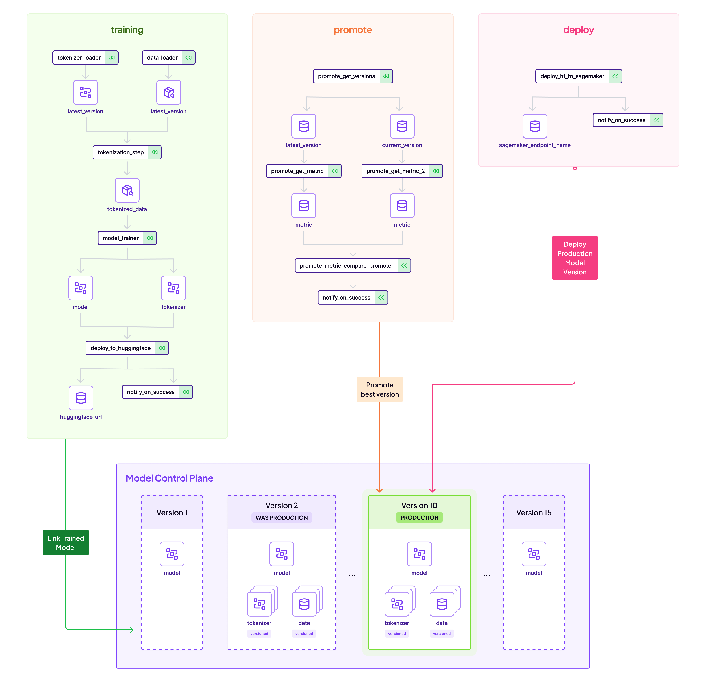

# Huggingface Model to Sagemaker Endpoint: Automating training and deployment with ZenML

While almost every Huggingface model can be easily deployed to AWS Sagemaker endpoints, it is often desirous to automate
this flow. This project showcases one way of using ZenML pipelines to achieve the following flow:

- Train/Finetune a NLP model and push to Huggingface Hub
- Promote this model from staging to production
- Deploy the model at the Production Stage to a Sagemaker endpoint

The above flow is achieved in a repeatable, fully tracked pipeline that is observable across the organization. Let's
see how this works.

## 👋 Get started

What to do first? You can start by giving the the project a quick run. The
project is ready to be used and can run as-is without any further code
changes! You can try it right away by installing ZenML, the needed
ZenML integration and then calling the CLI included in the project. We also
recommend that you start the ZenML UI locally to get a better sense of what
is going on under the hood:

```bash
# Set up a Python virtual environment, if you haven't already
python3 -m venv .venv
source .venv/bin/activate
# Install requirements & integrations
make setup
# Optionally, provision default local stack
make install-stack
# Start the ZenML UI locally (recommended, but optional);
# the default username is "admin" with an empty password
zenml up
```

When the pipelines are done running, you can check out the results in the ZenML
UI by following the link printed in the terminal (or you can go straight to
the [ZenML UI pipelines run page](http://127.0.0.1:8237/workspaces/default/all-runs?page=1).

The username should be `default` and password empty.

## A process overview

Here is an overview of the entire process:



## Train the model

Next, you should:

* look at the CLI help to see what you can do with the project:
```bash
python run.py --help
```

Write about training the model

### Show that ZenML control plane

## Promote the model 

Run the promotion pipeline to promote the pipeline to staging or do it manually via CLI.

## Deploy the model

## Run inference