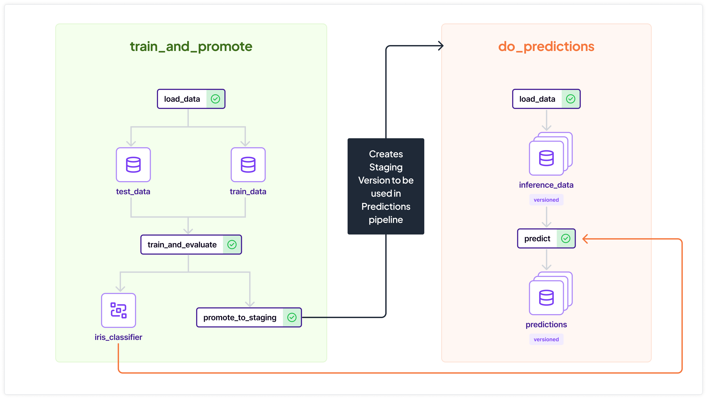

# Exploring the Model Control Plane Backend: A Practical Guide

Welcome to our tour into the Model Control Plane, where we'll focus on two independent pipelines within ZenML. Each pipeline works on its own, creating specific artifacts. But what's fascinating is that these seemingly separate pipelines are intricately connected, all with the goal of delivering precise predictions.

Before the Model Control Plane, connecting these pipelines and consolidating everything was a challenge. Imagine extracting a trained model artifact from the training pipeline and smoothly integrating it into the predictions pipeline. Previously, this involved complex ID references, leading to constant config updates, or blindly relying on the latest training run. But what if that run didn't meet the necessary performance standards? Using a subpar model for predictions was out of the question, especially for vital applications!

Enter the Model Control Plane. This feature empowers you to effortlessly group pipelines, artifacts, and crucial business data into a unified entity: a Model. A Model captures lineage information and more. Within a Model, different Model Versions can be staged. For example, you can rely on your predictions at a specific stage, like Staging, and decide whether the Model Version should be promoted based on your business rules during training. Plus, accessing data from other Models and their Versions is just as simple, enhancing the system's adaptability.

## Example Scenario

To illustrate these concepts, let's consider a `demo` Model will be created implicitly using the Python SDK.

### Getting Started
```bash
# make sure you have ZenML of 0.45.0 or above installed
pip3 install "zenml[dev]>=0.45.0"

# [Optional] clean up state before start 
zenml clean

# install needed integrations
zenml integration install sklearn

# verify existing models (if `zenml clean` executed - should be empty)
zenml model list
```

### Training pipeline
The Training pipeline orchestrates the training of a model object, storing datasets and the model object itself as links within a newly created Model Version. This integration is achieved by configuring the pipeline within a Model Context using `ModelConfig`. The `name` and `create_new_model_version` fields are specified, while other fields remain optional for this task.
```python
from zenml import pipeline
from zenml.model import ModelConfig

@pipeline(
    enable_cache=False,
    model_config=ModelConfig(
        name="demo",
        license="Apache",
        description="Show case Model Control Plane.",
        create_new_model_version=True,
        delete_new_version_on_failure=True,
    ),
)
def train_and_promote_model():
    ...
```
In the final step of the pipeline, the new Model Version is promoted to the Staging stage.
```python
from zenml import get_step_context, step, pipeline
from zenml.enums import ModelStages

@step
def promote_to_staging():
    model_config = get_step_context().model_config
    model_version = model_config._get_model_version()
    model_version.set_stage(ModelStages.STAGING, force=True)

@pipeline(
    ...
)
def train_and_promote_model():
    ...
    promote_to_staging(after=["train_and_evaluate"])
```

Running the training pipeline creates a model and a Model Version, all while maintaining a connection to the artifacts.
```bash
# run training pipeline: it will create a model, a 
# model version and link two datasets and one model 
# object to it, pipeline run is linked automatically
python3 train.py
```
Once it's done, check the results to see the newly created entities:
```bash
# new model `demo` created
zenml model list

# new model version `1` created
zenml model version list demo

# list generic artifacts - train and test datasets are here
zenml model version artifacts demo 1

# list model objects - trained classifier here
zenml model version model_objects demo 1

# list deployments - none, as we didn't link any
zenml model version deployments demo 1

# list runs - training run linked
zenml model version runs demo 1
```

### Predictions pipeline
The Predictions Pipeline reads a trained model object from the Model Version labeled as Staging. Here, the `version` is set to a specific stage, ensuring consistency across multiple runs. This approach shields the pipeline from the underlying complexities of the Training pipeline's promotion logic.
```python
from zenml import pipeline
from zenml.model import ModelConfig

@pipeline(
    enable_cache=False,
    model_config=ModelConfig(
        name="demo",
        version=ModelStages.STAGING,
    ),
)
def do_predictions():
    ...
```
Given the frequent execution of the predictions pipeline compared to the training pipeline, we link predictions as versioned artifacts. The `overwrite` flag in the artifact configuration controls this, allowing for a comprehensive historical view.
```python
@step
def predict(
    ...
) -> Annotated[
    pd.Series,
    "predictions",
    ArtifactConfig(artifact_name="iris_predictions", overwrite=False),
]:
    ...
```
Need to use a specific model version, not limited to stages? No problem. You can represent this either by version number or name, ensuring flexibility in your workflow.

### Artifacts Exchange Between Pipelines: Seamless Integration

In this pipeline, artifacts linked during the training stage are passed on. Leveraging `ExternalArtifact`, we effortlessly pass previously linked artifacts without repeating the model name and version setup.

*Handy Tip*: Explore further possibilities by using the `model_name` and `model_version` attributes of `ExternalArtifact` to pull artifacts from other models.

```python
from zenml.artifacts.external_artifact import ExternalArtifact

@pipeline(
    model_config=...,
    extra={"trained_classifier": "iris_classifier"},
)
def do_predictions():
    ...
    predict(
        model=ExternalArtifact(
            model_artifact_name=trained_classifier
        ),  # model_name and model_version derived from pipeline context
        ...
    )
    ...
```
Additionally, any extra configurations needed can be seamlessly passed and read using the `extra` pipeline argument and the new `get_pipeline_context` function.
```python
@pipeline(
    extra={"trained_classifier": "iris_classifier"},
)
def do_predictions():
    trained_classifier = get_pipeline_context().extra["trained_classifier"]
    ...
```

Executing the prediction pipeline ensures the use of the Model Version in Staging stage, generating predictions as versioned artifacts.
```bash
# run prediction pipeline: it will use Staging 
# staged Model Version to read Model Object and 
# produce predictions as versioned artifact link
python3 predict.py

# no new model version created, just consuming existing model
zenml model version list demo

# list train, test and inference datasets and predictions artifacts
zenml model version artifacts demo 1
```
Fantastic! By reusing the model version in the Staging stage, you've connected the inference dataset and predictions seamlessly. All these elements coexist within the same model version, allowing effortless tracing back to training data and model metrics.

And what if you run the prediction pipeline again?
```bash
# run prediction pipeline again: it will use same 
# Model Version again and link new predictions version link
python3 predict.py

# list train, test datasets and two version of 
# inference dataset and prediction artifacts
zenml model version artifacts demo 1

# list runs, prediction runs are also here
zenml model version runs demo 1
```
Everything worked seamlessly! You've added two more links to your artifacts, representing new predictions and inference dataset versions. Later, this detailed history can aid analysis or retrieving predictions from specific dates. Additionally, the prediction pipeline runs are conveniently attached to the same model version, ensuring you always know which code interacted with your models.

### Bringing Everything Together in Harmony
Now, let's tie all the threads together in a seamless flow.
<p align="center">
  
</p>

### More Command-Line Features
Explore additional CLI capabilities, like updating existing models and creating new ones, using straightforward commands.

#### Updating Existing Models via CLI
```bash
zenml model update demo -t tag1 -t tag2 -e "some ethical implications"
```
#### Creating a Model via CLI
```bash
zenml model register -n demo_cli -d "created from cli" -t cli
```

### Well done! Time for a Quick Cleanup
```bash
zenml model delete demo_cli
zenml model delete demo -y
```
Nicely done, and now your workspace is tidy! Feel free to reach out if you have any more questions or if there's anything else you'd like to explore. Happy modeling! 😊